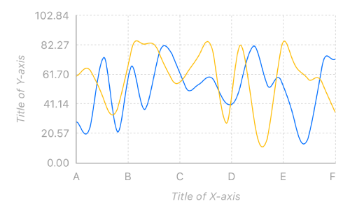
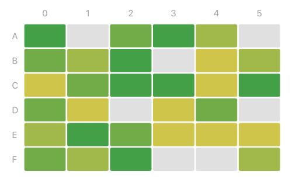

<p align="center">
<picture>
  <source media="(prefers-color-scheme: dark)" srcset="./Assets/DPChartsLogo.png" width="300">
  
</picture>
</p>

<br/>


DPCharts is a Swift-based lightweight framework designed specifically for rendering charts on iOS. Its main objective is to create a user-friendly chart library that follows the iOS delegation pattern approach. Each chart within the framework is responsible solely for presenting data, rather than managing the data itself. To manage the data, you provide the chart with a datasource object (an object conforming to the chart datasource protocol). Additionally, charts manage gesture interaction, and touch gesture events are delivered to the configured delegate (an object conforming to the chart delegate protocol) when applicable.

## Feature Highlights

DPCharts provides several features and extensive customization options. Presented below is a concise list showcasing some of its capabilities:

- **5** different chart types
- **Legend** support using a specific view
- **Storyboard** support by means of **@IBDesignable** and **@IBInspectable**
- **Animations** support (where applicable)
- **Touch gesture** interaction (where applicable)
- Highly customizable (colors, fonts, axis positioning, spacing, insets ...)

- Data control achieved by implementing a **datasource** protocol
- User interaction by means of implementing a **delegate** protocol
- APIs that resemble well-known UIKit views like **UITableView** and **UICollectionView**

## Available Charts

### BarChart


### BarChart (stacked)


### LineChart


### LineChart (with area)


### LineChart (with bezier curve)



### LineChart (with bezier curve and area)


### ScatterChart


### PieChart


### PieChart (as Donut)


### Heatmap



## Requirements

DPCharts can be installed on any platform that is compatible with it:

- iOS 12+
- Xcode 14+ 
- Swift 5.5+  

## Installation

### Cocoapods

Add the dependency to the `DPCharts` framework in your `Podfile`:

```ruby
pod 'DPCharts', '~> 1.0'
```

### Swift Package Manager

Add it as a dependency in a Swift Package:

```swift
dependencies: [
    .package(url: "https://github.com/danielepantaleone/DPCharts.git", .upToNextMajor(from: "1.0.0"))
]
```

## Running the demo

DPCharts includes a demo application to showcases all the chart features it offers.

- Make sure you are running a supported version of Xcode.
- Open the `DPCharts-Demo-iOS/DPCharts-Demo-iOS.xcodeproj` Xcode project.
- Run the `DPCharts-Demo-iOS` on a simulator.